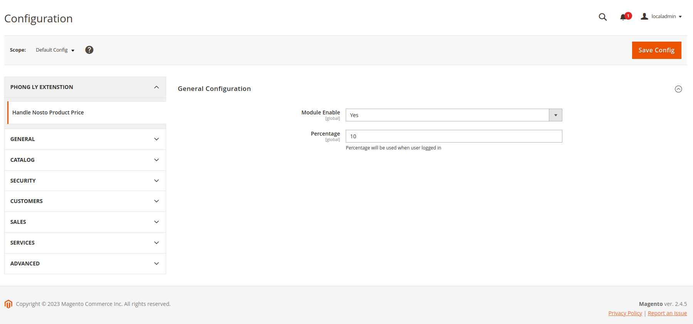

# nosto-product-price-discount
This is the magento 2 module will handle the price for nosto product. When this module is enabled, tt will calculate the
price based on the percent which merchant set in the configuration.

## Authors
- [Phong Ly](https://github.com/yquocphong)

## Dependency
- "php": "~7.4.0||~8.1.0",
- "nosto/module-nostotagging": "^7.2"

## Installation
Follow these steps:
1. Download this repository
2. Go to your magento root folder
3. Put this folder content to app/code/PhongLy
4. Clear cache by run
```
php bin/magento clear:cache
```
5. Run setup upgrade
```
php bin/magento setup:upgrade
```

## Configuration
You can config the module by go to Stores -> Configuration -> Phong Ly Extenstion -> General Configuration

1. Enabled/Disabled
This configuration determine the module is enabled or not. Default is yes

2. Discount percent
This configuration is the discount percent will be applied to Nosto product when customer logged in 

## Contributing

Pull requests are welcome. For major changes, please open an issue first
to discuss what you would like to change.

Please make sure to update tests as appropriate.

## License

[MIT](https://choosealicense.com/licenses/mit/)
